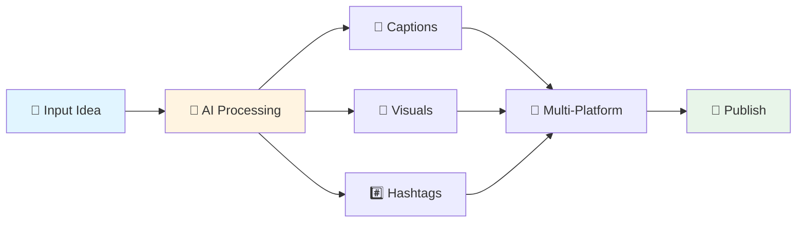

<div align="center">

# 🚀 Postify — AI Copilot for Content Creators

### *Transform Ideas into Viral Content in Minutes*

[](https://github.com)
[](https://reactjs.org/)
[](https://www.djangoproject.com/)
[](https://tailwindcss.com/)

**AI-powered assistant that generates, optimizes, analyzes, organizes, and schedules social media content automatically across platforms.**

[Features](#-key-features) • [Tech Stack](#-technology-stack) • [Team](#-team-details)

</div>

---

## 📌 Problem Statement

<table>
<tr>
<td width="50%">

### 😓 The Challenge

Content creators face overwhelming challenges:

- ⏰ **Time-consuming** caption writing
- 🔍 **Exhausting** hashtag and hook research
- 🔄 **Complex** multi-platform adaptation
- 🎨 **Heavy** visual creation workload
- 📋 **Lack** of structured planning
- 📊 **Difficulty** analyzing engagement

</td>
<td width="50%">

### 💭 The Reality

> *"Creators spend more time planning content than creating it."*

**The result?** Burnout, inconsistent posting, and missed opportunities for growth.

</td>
</tr>
</table>

---

## 💡 Proposed Solution

<div align="center">

### ✨ **Postify: Your AI Content Creation Partner**

*An intelligent platform that automates the entire content lifecycle*

</div>



### 🎯 What You Get

<table>
<tr>
<td align="center">📝</td>
<td><b>Ready-to-post captions</b></td>
<td align="center">🔄</td>
<td><b>Platform-specific versions</b></td>
</tr>
<tr>
<td align="center">#️⃣</td>
<td><b>Relevant hashtags & hooks</b></td>
<td align="center">🎨</td>
<td><b>AI-generated visuals</b></td>
</tr>
<tr>
<td align="center">📅</td>
<td><b>Smart scheduling</b></td>
<td align="center">📂</td>
<td><b>Draft organization</b></td>
</tr>
<tr>
<td align="center">📊</td>
<td><b>Engagement insights</b></td>
<td align="center">🎯</td>
<td><b>Funnel workflows</b></td>
</tr>
</table>

> **Focus on creativity, not execution** — Let AI handle the rest!

---

## 👥 Target Users

<div align="center">

| 🎭 Creators | 💼 Businesses | 🎓 Educators | 💻 Professionals | 🏢 Agencies |
|:---:|:---:|:---:|:---:|:---:|
| Influencers | Marketers | YouTubers | LinkedIn Users | Digital Teams |
| Content Makers | Small Business | Course Creators | Thought Leaders | Social Media Mgmt |

</div>

---

## ✨ Key Features

<details open>
<summary><h3>📝 Content Generation Enhancements</h3></summary>

- 🌐 **Multi-platform Generation** — LinkedIn, Instagram, X (Twitter), YouTube
- 🎯 **CTA Generator** — High-conversion calls to action
- 🐦 **Tweet/Thread Generation** — Punchy tweets and engaging threads

</details>

<details open>
<summary><h3>📊 Analysis & Insights</h3></summary>

- 📈 **Analytics Dashboard** — Centralized performance tracking
- 🧠 **AI Insights Feed** — Data-driven trends and recommendations
- 💬 **Comments Analyzer** — Extract audience themes and sentiment

</details>

<details open>
<summary><h3>📅 Organization & Planning</h3></summary>

- 📂 **Drafts Management Library** — Centralized content storage
- 🗓️ **Content Calendar Scheduling** — Visual post planning and automation

</details>

<details open>
<summary><h3>🎨 Visual & Media Management</h3></summary>

- 🖼️ **Thumbnail/Image Prompt Generation** — Optimize visuals for all platforms
- 🤖 **AI Image Generation** — Integrated Stable Diffusion and DeepAI
- ☁️ **Media Storage** — S3/Cloudinary backed with preview links

</details>

<details open>
<summary><h3>🌪️ Funnel & Engagement Tools</h3></summary>

- 🎯 **Interactive Funnel Builder** — Plan customer conversion journeys
- ⚡ **Real-time Dynamic Pitch & CTA** — Engagement-driven content
- 🔗 **Public Funnel Preview/Share Links** — Collaborative funnel sharing
- 📣 **Promotional Post Generation** — Targeted content for funnels

</details>

<details open>
<summary><h3>🚀 Publishing Workflow</h3></summary>

- ✅ **Approve → Post Now** — Direct Instagram integration
- 💾 **Approve → Save to Drafts** — Fallback for offline planning

</details>

---

## 💻 Technology Stack

<div align="center">

### 🏗️ Built with Modern Technologies

<table>
<tr>
<td align="center" width="25%">
<br/>


</td>
<td align="center" width="25%">
<br/>


</td>
<td align="center" width="25%">
<br/>


</td>
<td align="center" width="25%">
<br/>


</td>
</tr>
</table>

</div>

---

## 🏆 Unique Selling Proposition

<div align="center">

### 🌟 **All-in-One Content Powerhouse**

```
┌─────────────────────────────────────────────────────────────┐
│  Generation → Analytics → Organization → Visuals → Funnels  │
│                    ↓                                         │
│              📱 Unified Workflow                             │
│                    ↓                                         │
│         💡 Idea → 🚀 Published (in minutes!)                │
└─────────────────────────────────────────────────────────────┘
```

**No more juggling multiple tools.** Everything you need in one place.

</div>

---

## 🚀 Future Scope

<table>
<tr>
<td>🤝</td>
<td><b>Multi-account/Team Collaboration</b><br/><i>Manage multiple brands and team workflows</i></td>
</tr>
<tr>
<td>🔥</td>
<td><b>Automated Trend Discovery</b><br/><i>AI-powered trend spotting and recommendations</i></td>
</tr>
<tr>
<td>📊</td>
<td><b>Cross-platform Analytics Integration</b><br/><i>Unified insights from all social networks</i></td>
</tr>
<tr>
<td>🎯</td>
<td><b>Smart Publishing Optimization</b><br/><i>AI-driven best time to post predictions</i></td>
</tr>
</table>

---

## 👥 Team Details

<div align="center">

### 🎯 **Team Split**

<table>
<tr>
<td align="center" width="25%">
<br/>
<b>Divy</b>
</td>
<td align="center" width="25%">
<br/>
<b>Jiya</b>
</td>
<td align="center" width="25%">
<br/>
<b>Nirmit</b>
</td>
<td align="center" width="25%">
<br/>
<b>Aahan</b>
</td>
</tr>
</table>

---

<p>
<i>Built with ❤️ by Team Split</i><br/>
<b>Transforming content creation, one post at a time.</b>
</p>

</div>


