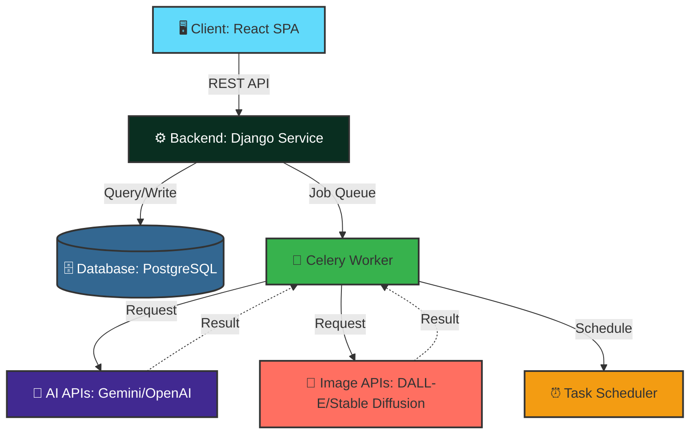
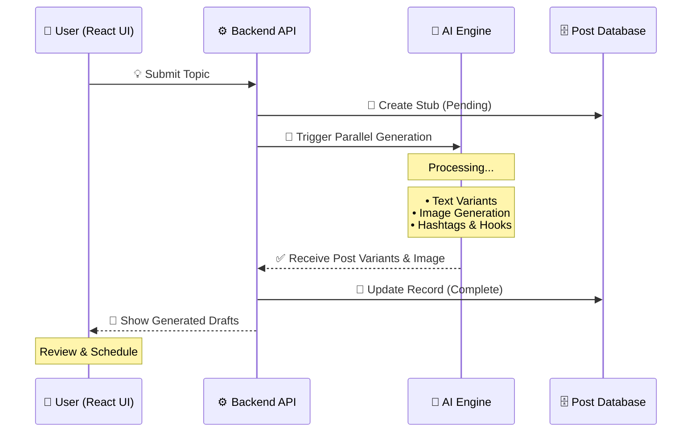
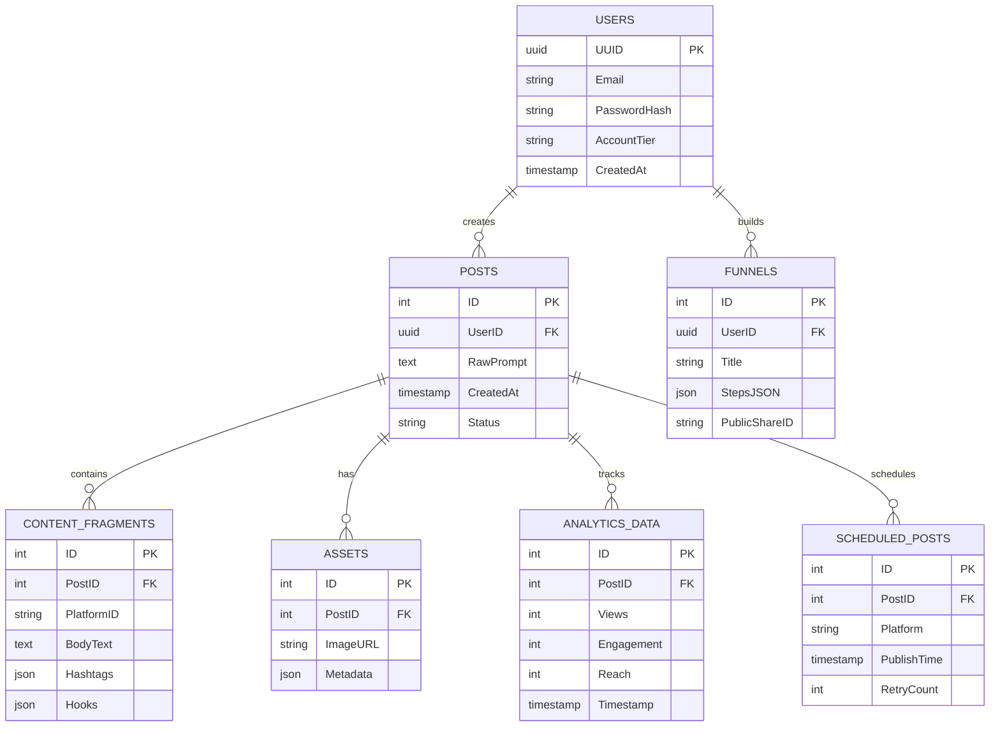

<div align="center">

# 🏗️ Postify — Technical Design & Architecture

### *Comprehensive System Design Documentation*

[](https://github.com)
[](https://github.com)
[](https://github.com)

</div>

---

## 1. 🎯 System Overview

Postify is a **cloud-based platform** designed to automate social media content management. The system is architected to handle:

- 🤖 **Complex AI content generation**
- 🖼️ **Asynchronous image processing**
- ⚡ **Responsive user interface**
- 🔄 **Real-time orchestration**

> **Mission:** Bridge the gap between raw creative ideas and platform-ready social media assets through structured orchestration of Large Language Models (LLMs) and Image Generation APIs.

## 2. 🏛️ High-Level Architecture

<div align="center">

### **Three-Tier Architecture** for Scalability & Separation of Concerns

</div>

### 🗺️ System Flow (Visual Map)

```text
┌─────────────────┐        ┌──────────────────┐        ┌──────────────────┐
│  Frontend App   │ ◄────► │   Backend API    │ ◄────► │  AI Engine SDK   │
│    (React)      │        │ (Django/Flask)   │        │ (Gemini/GPT-4)   │
│                 │        │                  │        │                  │
│  • TailwindCSS  │        │  • REST APIs     │        │  • LLM Models    │
│  • State Mgmt   │        │  • Auth Layer    │        │  • Image Gen     │
│  • UI/UX        │        │  • Task Queue    │        │  • Vision APIs   │
└────────┬────────┘        └────────┬─────────┘        └────────┬─────────┘
         │                          │                           │
         │                  ┌───────▼──────────┐                │
         └─────────────────►│  Data & Tasks    │◄───────────────┘
                            │ (Postgres/Redis) │
                            │                  │
                            │  • User Data     │
                            │  • Post Storage  │
                            │  • Job Queue     │
                            └──────────────────┘
```

### 🧬 Logical Topology (Mermaid)



## 3. 🧩 Module Breakdown

<table>
<tr>
<td width="50%">

### 🎯 Core Modules

| Module | Description |
|:-------|:------------|
| 🎛️ **Core Orchestrator** | Primary backend module managing workflow from user input to multi-platform variants |
| 🤖 **AI Adaptation Engine** | Translates prompts into platform-specific formats (IG, LI, YT, X) |
| 🎨 **Visual Synthesis Module** | Interface for Stable Diffusion/DeepAI APIs to generate and optimize images |
| ⏰ **Scheduling & Automation** | Time-based task runner for post queuing and draft persistence |

</td>
<td width="50%">

### 🔧 Supporting Modules

| Module | Description |
|:-------|:------------|
| ☁️ **Media Storage Manager** | Secure storage (S3/Cloudinary) and retrieval of AI visuals |
| 📊 **Analytics & Insight Engine** | Processes performance data and generates AI-driven recommendations |
| 💬 **Comments Analysis Module** | Extracts themes and sentiment from audience interactions |
| 🌪️ **Funnel Builder Module** | Constructs and manages interactive conversion funnels |
| 🚀 **Publishing Automation** | Instagram Graph API integration for direct posting |

</td>
</tr>
</table>

## 4. 🔄 Data Flow Description

### 📝 Post Generation Sequence



### 🎯 Step-by-Step Process

<table>
<tr>
<td align="center" width="20%">1️⃣<br/><b>Initiation</b></td>
<td>User submits a "Project Idea" via the React frontend</td>
</tr>
<tr>
<td align="center" width="20%">2️⃣<br/><b>Contextualization</b></td>
<td>Backend converts idea into structured prompts for AI APIs</td>
</tr>
<tr>
<td align="center" width="20%">3️⃣<br/><b>Parallel Generation</b></td>
<td>Engine generates text variants and custom visuals simultaneously</td>
</tr>
<tr>
<td align="center" width="20%">4️⃣<br/><b>Validation & Storage</b></td>
<td>Assets stored in database with "Unpublished" status</td>
</tr>
<tr>
<td align="center" width="20%">5️⃣<br/><b>Finalization</b></td>
<td>User reviews content and assigns posting time via Scheduling Module</td>
</tr>
</table>

## 5. 🌐 API Endpoints Overview

<div align="center">

### RESTful API Design

</div>

| Endpoint | Method | Purpose | Status |
| :--- | :---: | :--- | :---: |
| 🔐 `/api/auth` | `POST` | User authentication and session management | ✅ |
| 🤖 `/api/generate` | `POST` | Trigger the full text-to-content generation pipeline | ✅ |
| 📝 `/api/posts` | `GET` | Retrieve the library of saved and generated posts | ✅ |
| 📅 `/api/schedule` | `PUT` | Assign a posting date/time to a generated asset | ✅ |
| 🖼️ `/api/media` | `GET` | Fetch URLs for AI-generated images | ✅ |
| 📊 `/api/analytics` | `GET` | Retrieve performance metrics and insights | 🔄 |
| 🌪️ `/api/funnels` | `POST` | Create and manage conversion funnels | 🔄 |
| 💬 `/api/comments` | `GET` | Fetch and analyze audience comments | 🔄 |

<sub>✅ Implemented | 🔄 In Progress | ⏳ Planned</sub>

## 6. 🗄️ Database Schema Overview



### 📋 Table Descriptions

<details>
<summary><b>👤 Users</b> — User account management</summary>

- `UUID` — Unique user identifier
- `Email` — User email address
- `PasswordHash` — Encrypted password
- `AccountTier` — Subscription level (Free/Pro/Enterprise)

</details>

<details>
<summary><b>📝 Posts</b> — Core content storage</summary>

- `ID` — Post identifier
- `UserID` — Foreign key to Users
- `RawPrompt` — Original user input
- `CreatedAt` — Timestamp
- `Status` — Draft/Published/Scheduled

</details>

<details>
<summary><b>🔄 ContentFragments</b> — Platform-specific variants</summary>

- `ID` — Fragment identifier
- `PostID` — Foreign key to Posts
- `PlatformID` — IG/LI/TW/YT
- `BodyText` — Platform-optimized caption
- `Hashtags` — Relevant hashtags (JSON)
- `Hooks` — Attention-grabbing hooks (JSON)

</details>

<details>
<summary><b>🖼️ Assets</b> — Media storage references</summary>

- `ID` — Asset identifier
- `PostID` — Foreign key to Posts
- `ImageURL` — S3/Cloudinary URL
- `Metadata` — Image properties (JSON)

</details>

<details>
<summary><b>📊 AnalyticsData</b> — Performance metrics</summary>

- `ID` — Analytics record identifier
- `PostID` — Foreign key to Posts
- `Views` — View count
- `Engagement` — Likes, comments, shares
- `Reach` — Unique users reached
- `Timestamp` — Data collection time

</details>

<details>
<summary><b>🌪️ Funnels</b> — Conversion funnel management</summary>

- `ID` — Funnel identifier
- `UserID` — Foreign key to Users
- `Title` — Funnel name
- `StepsJSON` — Funnel stages (JSON)
- `PublicShareID` — Shareable link ID

</details>

<details>
<summary><b>⏰ ScheduledPosts</b> — Publishing queue</summary>

- `ID` — Schedule identifier
- `PostID` — Foreign key to Posts
- `Platform` — Target platform
- `PublishTime` — Scheduled timestamp
- `RetryCount` — Failed attempt counter

</details>

## 7. 📈 Scalability Considerations

<table>
<tr>
<td width="50%">

### ⚡ Performance Optimization

- 🔄 **Asynchronous Processing**
  - Task queues (Celery) prevent blocking during AI generation
  - Non-blocking I/O for improved throughput
  
- 📊 **Horizontal Scaling**
  - Stateless backend architecture
  - Load balancing across multiple instances
  - Auto-scaling based on demand

</td>
<td width="50%">

### 🚀 Infrastructure Strategy

- 💾 **Caching Layer**
  - Redis for session management
  - Frequently accessed data caching
  
- 🗄️ **Database Optimization**
  - Connection pooling
  - Query optimization
  - Read replicas for analytics

</td>
</tr>
</table>

---

## 8. 🔒 Security Considerations

| Layer | Implementation | Status |
|:------|:--------------|:------:|
| 🔐 **Authentication** | JWT-based secure session management | ✅ |
| 🔑 **API Keys** | Environment variables for AI API credentials | ✅ |
| 🛡️ **Data Encryption** | TLS/SSL for data in transit | ✅ |
| 👤 **User Privacy** | GDPR-compliant data handling | ✅ |
| 🚫 **Rate Limiting** | API throttling to prevent abuse | 🔄 |
| 📝 **Audit Logging** | Track all system operations | 🔄 |

---

## 9. 🚀 Deployment Overview


### 🏗️ Deployment Strategy

- 🐳 **Containerization:** Docker for consistent environments
- ☁️ **Cloud Native:** Managed cloud platform (AWS/GCP/Azure)
- 🔄 **CI/CD Pipeline:** Automated testing and deployment
- 📊 **Monitoring:** Real-time performance tracking
- 🔧 **Auto-scaling:** Dynamic resource allocation

---

## 10. 🔮 Future Technical Improvements

<table>
<tr>
<td align="center">🎯</td>
<td><b>RAG Implementation</b></td>
<td>Personalize content based on user's unique brand voice using Retrieval-Augmented Generation</td>
</tr>
<tr>
<td align="center">📊</td>
<td><b>Analytics Integration</b></td>
<td>Direct API connections to pull real-time performance data from all social networks</td>
</tr>
<tr>
<td align="center">🤖</td>
<td><b>Advanced AI Models</b></td>
<td>Integration with latest LLMs and multimodal AI capabilities</td>
</tr>
<tr>
<td align="center">🔍</td>
<td><b>Semantic Search</b></td>
<td>Vector database for intelligent content discovery and recommendations</td>
</tr>
<tr>
<td align="center">🌐</td>
<td><b>Multi-region Deployment</b></td>
<td>Global CDN and edge computing for reduced latency</td>
</tr>
<tr>
<td align="center">📱</td>
<td><b>Mobile Apps</b></td>
<td>Native iOS and Android applications for on-the-go content management</td>
</tr>
</table>

---

<div align="center">

### 🎯 Built for Scale, Designed for Performance

*Postify's architecture is engineered to handle millions of content generations while maintaining sub-second response times.*

</div>
