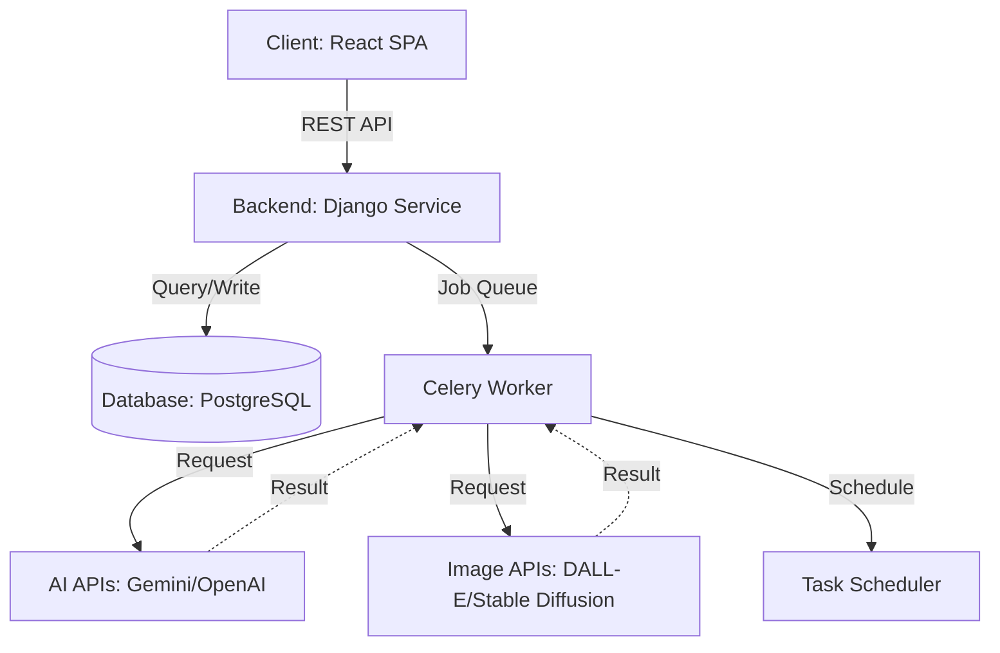
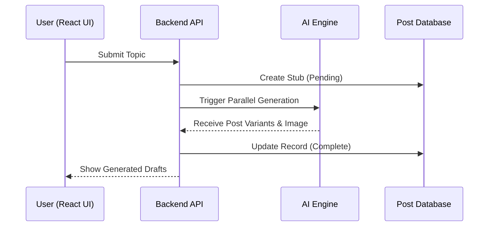

# Postify — Technical Design & Architecture

## 1. System Overview
Postify is a cloud-based platform designed to automate social media content management. The system is architected to handle complex AI content generation and asynchronous image processing while maintaining a responsive user interface. It bridges the gap between raw creative ideas and platform-ready social media assets through a structured orchestration of Large Language Models (LLMs) and Image Generation APIs.

## 2. High-Level Architecture
The system follows a classic **Three-Tier Architecture** for scalability and separation of concerns.

### 🗺️ System Flow (Visual Map)
```text
  +----------------+        +------------------+        +------------------+
  |  Frontend App  | <----> |   Backend API    | <----> |   AI Engine SDK  |
  |    (React)     |        | (Django/Flask)   |        | (Gemini/GPT-4)   |
  +-------+--------+        +--------+---------+        +---------+--------+
          |                          |                            |
          |                  +-------v---------+                  |
          +----------------> |  Data & Tasks   | <----------------+
                             | (Postgres/Redis)|
                             +-----------------+
```

### 🧬 Logical Topology (Mermaid)


## 3. Module Breakdown
- **Core Orchestrator:** The primary backend module that manages the workflow from user input to final multi-platform variants.
- **AI Adaptation Engine:** Specialized sub-module that translates a single prompt into specific formats optimized for Instagram, LinkedIn, YouTube, and Twitter/X.
- **Visual Synthesis Module:** Interface for DALL-E/Stability APIs to generate, optimize, and store image assets.
- **Scheduling & Automation System:** A time-based task runner that manages the queue for future posts and draft persistence.
- **Media Hosting Manager:** Handles the storage and retrieval of AI-generated visuals.

## 4. Data Flow Description

### User Flow Diagram

```
┌─────────────────────────────────────────────────────────────────┐
│                         USER JOURNEY                            │
└─────────────────────────────────────────────────────────────────┘

    ┌──────────┐
    │  Login   │
    └────┬─────┘
         │
         ▼
    ┌──────────────┐
    │ Enter Topic  │
    │   or Idea    │
    └──────┬───────┘
           │
           ▼
    ┌──────────────────┐
    │  AI Processing   │
    │  ┌────────────┐  │
    │  │ Text Gen   │  │
    │  │ Image Gen  │  │
    │  │ Hashtags   │  │
    │  └────────────┘  │
    └──────┬───────────┘
           │
           ▼
    ┌──────────────────┐
    │ Review Generated │
    │    Content       │
    │  ┌────────────┐  │
    │  │ Instagram  │  │
    │  │ LinkedIn   │  │
    │  │ Twitter    │  │
    │  │ YouTube    │  │
    │  └────────────┘  │
    └──────┬───────────┘
           │
           ▼
    ┌──────────────────┐
    │  Edit/Customize  │
    │   (Optional)     │
    └──────┬───────────┘
           │
           ▼
    ┌──────────────────┐
    │  Choose Action   │
    └──────┬───────────┘
           │
      ┌────┴────┐
      ▼         ▼
┌──────────┐ ┌──────────┐
│ Schedule │ │   Save   │
│  Post    │ │  Draft   │
└──────────┘ └──────────┘
      │         │
      └────┬────┘
           │
           ▼
    ┌──────────────┐
    │  Dashboard   │
    │ Manage Posts │
    └──────────────┘
```

### Post Generation Sequence


1. **Initiation:** The user submits a "Project Idea" via the React frontend.
2. **Contextualization:** The Backend converts this idea into a series of structured prompts for the AI APIs.
3. **Parallel Generation:** The engine generates text variants and custom visuals simultaneously.
4. **Validation & Storage:** The assets are stored in the database with an "Unpublished" status.
5. **Finalization:** The user reviews the content and assigns a posting time via the Scheduling Module.

## 5. API Endpoints Overview
| Endpoint | Method | Purpose |
| :--- | :--- | :--- |
| `/api/auth` | `POST` | User authentication and session management. |
| `/api/generate` | `POST` | Trigger the full text-to-content generation pipeline. |
| `/api/posts` | `GET` | Retrieve the library of saved and generated posts. |
| `/api/schedule` | `PUT` | Assign a posting date/time to a generated asset. |
| `/api/media` | `GET` | Fetch URLs for AI-generated images. |

## 6. Database Schema Overview
- **Users:** `UUID, Email, PasswordHash, AccountTier`.
- **Posts:** `ID, UserID, RawPrompt, CreatedAt, Status`.
- **ContentFragments:** `ID, PostID, PlatformID (IG/LI/TW/YT), BodyText, Hashtags, Hooks`.
- **Assets:** `ID, PostID, ImageURL, Metadata`.
- **JobQueue:** `ID, PostID, ScheduledAt, IsCompleted`.

## 7. Scalability Considerations
- **Asynchronous Processing:** Using task queues (e.g., Celery) to prevent blocking during AI generation.
- **Horizontal Scaling:** The stateless backend architecture allows for scaling across multiple instances.

## 8. Security Considerations
- **Credential Safety:** All AI API keys are managed via secure environment variables.
- **Session Management:** Secure JWT-based authentication for user interactions.

## 9. Deployment Overview
- **Deployment:** The application is containerized with Docker and deployed to a managed cloud environment for reliability and auto-scaling.

## 10. Future Technical Improvements
- **RAG Implementation:** Personalizing content based on a user's unique brand voice.
- **Analytics Integration:** Direct API connections to pull performance data from social networks.

---

**Architecture designed for AI for Bharat Hackathon - Problem Statement 2**
